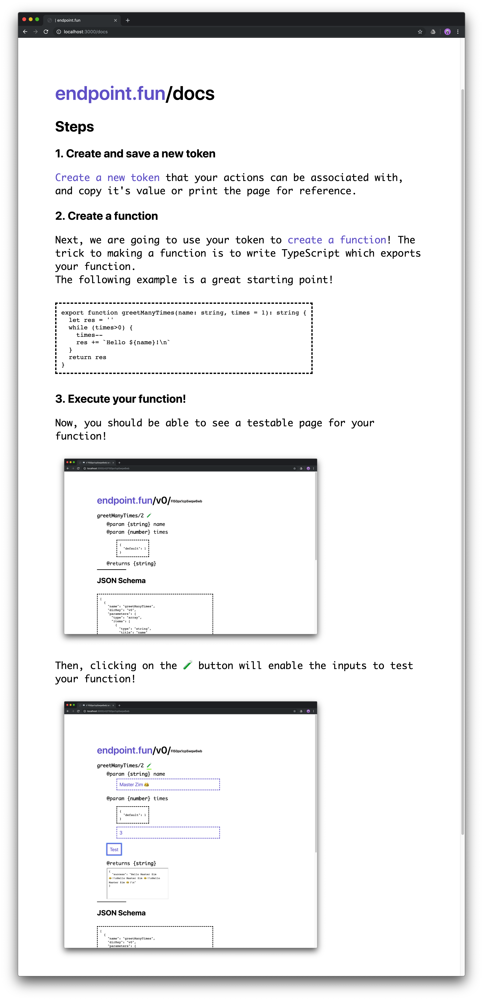

# How to start

Start the docker container for hosting postgres
```sh
docker-compose up
```

In another terminal, we will set up our `ui`
```sh
cd ui
yarn # install dependencies
yarn start # run server
```

Then, if all goes well, you should be able to open [http://localhost:3000/docs](http://localhost:3000/docs)!

This page should roughly resemble the docs page here:


